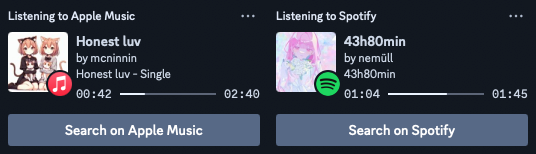

# MusicRPC
All-In-One Discord Music RPC for Apple Music, Spotify, TIDAL and Deezer.

## Preview

## Services
MusicRPC technically supports all services (even on the browser), however it's limited to:
- Apple Music
- iTunes
- Spotify
- TIDAL
- Deezer (limited - not all data is provided)
- foobar2000

If you want to have a service added, [open an issue](https://github.com/AlexandraAurora/MusicRPC/issues/new/choose).

## Installation
1. Download the latest `dmg` from the [releases](https://github.com/AlexandraAurora/MusicRPC/releases)
2. Drag MusicRPC into the `Applications` folder

## Compatibility
Mac running macOS 11 or later.\
If you're looking for a Windows version, check out [Music Presence](https://github.com/jonasberge/discord-music-presence) by Jonas van den Berg.

## Behind The Scenes
### How is this achieved?
MusicRPC utilizes a private framework called MediaRemote. MediaRemote is responsible for the system wide now-playing data, which means it can be utilized to retrieve the current song name etc. from any app that's registered as a now-playing app.
### How is MediaRemote linked?
Xcode needs to be told to look for private frameworks. This can be done by adding `$(DEVELOPER_DIR)/Platforms/MacOSX.platform/Developer/SDKs/MacOSX.sdk/System/Library/PrivateFrameworks` to the project's `Build Settings` under `Search Paths -> Framework Search Paths`. After that, `MediaRemote.framework` can be embedded from `~/Library/Developer/Xcode/UserData/`.
### Looking for the Game SDK implementation?
Find it [here](https://github.com/AlexandraAurora/MusicRPC/tree/game-sdk).

## License
[GPLv3](https://github.com/AlexandraAurora/MusicRPC/blob/main/COPYING)
